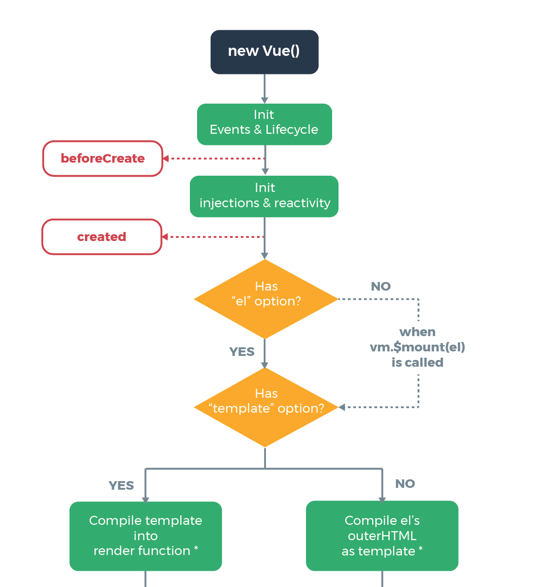
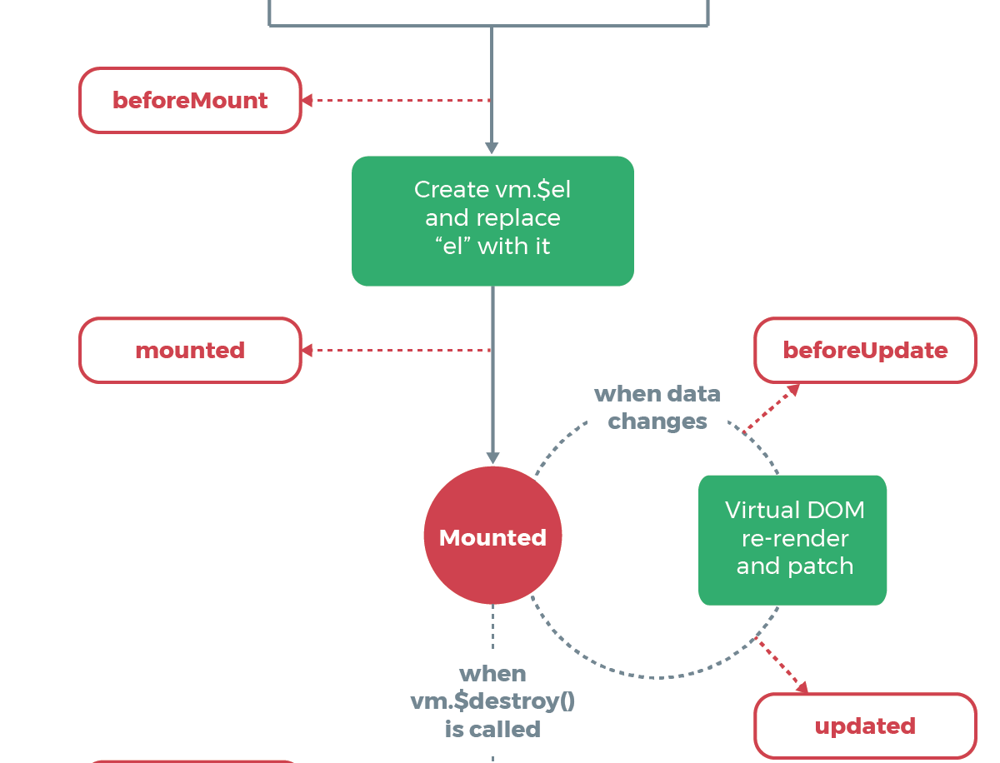
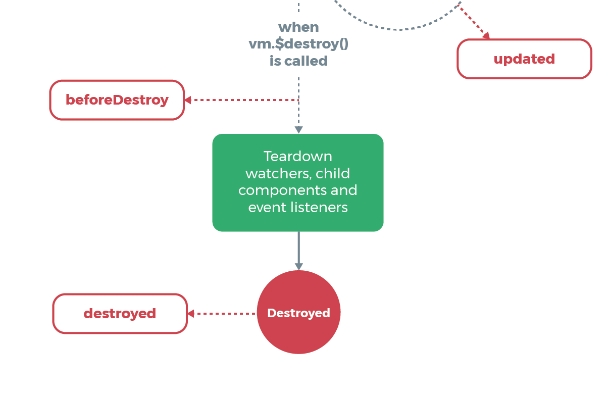

name: inverse
layout: true
class: center, middle, inverse
---
# Développement web avancé
## Séance 2

---
## Rappels Vue.js


---
layout: false

```js
window.app = new Vue()
```
---

```js
window.app = new Vue({
    el: "#app"
})
```
--
----
```html
<html>
...
    <div id="app">
        <ul>
            <li v-for="movie in movies"></li>
        </ul>
    </div>
...
</html>
```
--
----
```js
window.app = new Vue({
    el: "#app",
    template: `<ul>
        <li v-for="movie in movies"></li>
    </ul>`
})
```
```html
<html>
...
    <div id="app"></div>
...
</html>
```

---
## Data
```js
window.app = new Vue({
    el: "#app",
    data: {
        message: "Hello!"
    }
})
```

```html
<div id="app">
    {{message}}
</div>
```
--
```html
<a v-bind:href="message"></a>
<a :href="message"></a>
```

---
## Data

```js
window.app = new Vue({
    el: "#app",
    data: {
        array: ["a", "b"],
        display: true
    }
})
```

```html
<ul v-if="display">
    <li v-for="e in array" v-bind:key="e">{{e}}</li>
</ul>
```

---

## Methods

```js
window.app = new Vue({
    el: "#app",
    methods: {
        method_click: function() {
            alert("Clicked");
            // Utiliser `this` pour accéder aux data
        }
    }
})
```

```html
<button v-on:click="method_click"></button>
<button @click="method_click"></button>
```

---
.large[]

---
.large[]

---
.large[]

---

## Components

```html
<message-item msg="Hello""></message-item>
```
--
```js
Vue.component('message-item', {
    template: '<p>Un message</p>',
})
```
--
```js
Vue.component('message-item', {
    props: [ "msg" ]
    template: '<li>{{msg}}</li>',
})
```

---
template: inverse

## NPM

---

Gestionnaire de paquets : https://www.npmjs.com/

* Packages : 589 339
* Downloads - Last day : 561 114 892
* Downloads - Last week : 3 443 685 310
* Downloads - Last month : 14 502 331 276

Les dépendances sont définies dans un fichier **package.json**

```json
{
  "name": "demo-lp-dawin",
  "description": "Demo project for LP DAWIN",
  "version": "1.0.0",
  "author": "Simon Clériot <cleriotsimon@gmail.com>",
  "dependencies": {
      "vue": "2.5.8"
  }
}
```

---

## Require (CommonJS)

```js
module.exports = VueObject;
```

```js
var vue = require('vue');
```

---

## Import (ES modules)

```js
export default VueObject;
export const a = 8;
```

```js
import Vue from 'Vue';
import {a} from 'Vue';
import {a as b} from 'Vue';
import {default as def, a} from 'Vue';
```


* Chemin absolu : L'interpréteur va chercher dans le dossier **node\_modules**, et remonte tout les dossiers **node\_modules** parents
* Chemin relatif (`import MyComponent from './myfile.js`) : L'interpréteur va chercher dans le dossier du fichier qui demande l'import

---
template: inverse

## Single File Components

---

#### Objectif

```tree
|_ app.js
|_ package.json
|_ node_modules/ ...
|_ components/
    |_ component_1.vue
    |_ component_2.vue
```

```html
<template>
    <div>
        ...
    </div>
</template>

<script>
export default {
    data: function() {
        return {
            //data
        }
    } 
}
</script>

<style scoped>
    /* Style spécifique à ce composant */
</style>
```