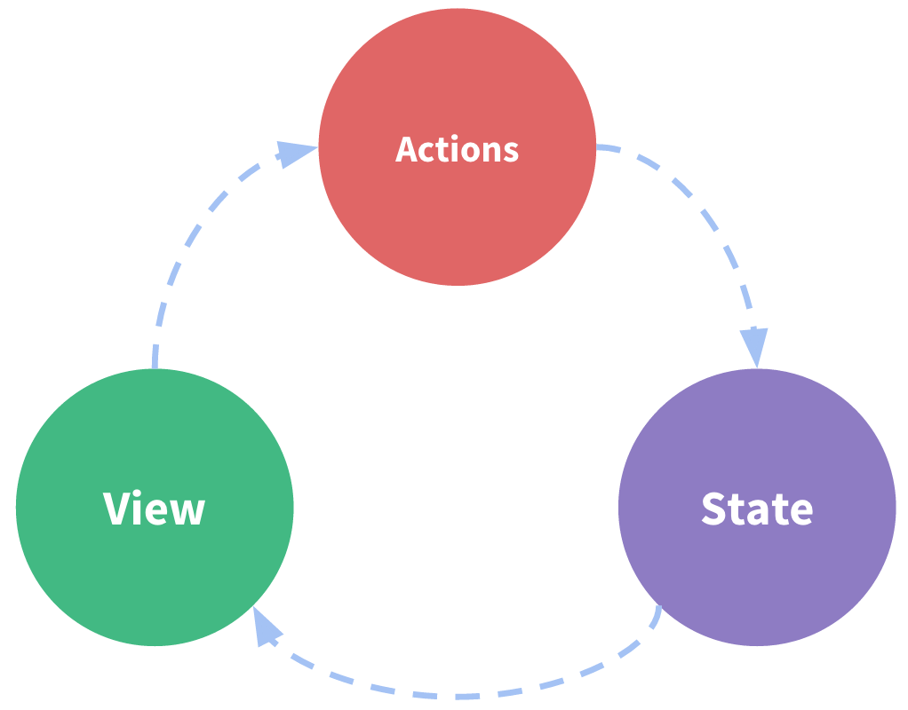
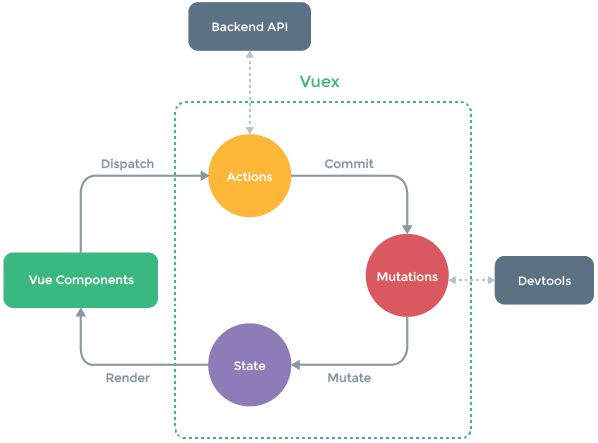

name: inverse
layout: true
class: center, middle, inverse
---
# Développement web avancé
## Séance 3

---
## Rappels de la séance précédente

---
layout: false

## NPM

* Gestionnaire de paquet
* https://www.npmjs.com
* package.json

```json
{
    "name": "demo-lp-dawin",
    "description": "Demo project for LP DAWIN",
    "version": "1.0.0",
    "author": "Simon Clériot <cleriotsimon@gmail.com>",
    "dependencies": {
        "vue": "2.5.8"
    }
}
```

---
## Import (ES modules)

```js
export default VueObject;
export const a = 8;
```

```js
import Vue from 'Vue';
import {a} from 'Vue';
import {a as b} from 'Vue';
import {default as def, a} from 'Vue';

import Obj from './localfile.js'
```

---
## Single File Component

```tree
|_ app.js
|_ package.json
|_ node_modules/ ...
|_ components/
    |_ component_1.vue
```

```html
<template>
    <div>
        ...
    </div>
</template>

<script>
export default {
    data: function() {
        return {
            //data
        }
    } 
}
</script>

<style scoped>
    /* Style spécifique à ce composant */
</style>
```

---
template: inverse

# Vuex
## State management library

---
## Quel est le problème ?



Comment utiliser les même données entre plusieurs composants ?
* Props
* Events
* `this.$refs`

**Solutions difficilement maintenables au fur et à mesure que la base de code grossi**

---
#### Vuex

* **State management library** intégrée à Vue.js

* Gérer les données partagées entre plusieurs composants

.medium[]

---
## Debug amélioré dans le navigateur

.large[]
