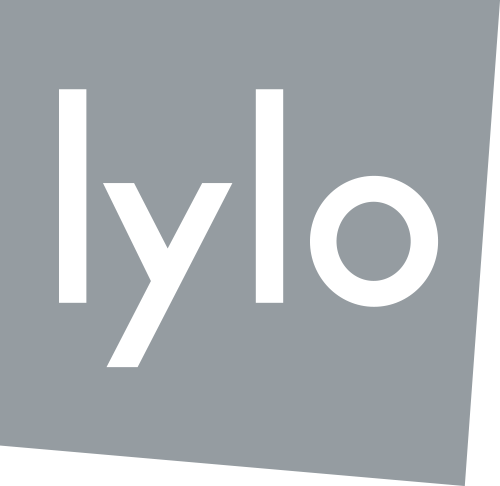
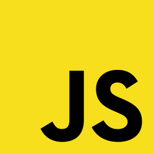

name: inverse
layout: true
class: center, middle, inverse
---
# Développement web avancé
## Séance 1
---
layout:false

.left-column[
## Simon Clériot
cleriotsimon@gmail.com
[@scleriot](https://twitter.com/scleriot)
]

.reallylarge[]



---
layout:false

# Backend
.large[]

---
layout:false

# Frontend
.large[]
---
layout:false

# Frontend
.reallylarge[]

---
## Javascript

.left-column[


]

* Créé en 1995 par Brendan Eich
* ECMAScript en 1997. Plusieurs implémentations :


???
* Netscape 1995
* Mozilla Foundation 1998

* Implémentations plus ou moins à jour

---
template: inverse

## Aperçu du language

---
.left-column[
## Le language
]

.footnote[
**Documentation** : https://developer.mozilla.org/fr/docs/Web/JavaScript
]


* Interprété (pas de compilation)
--

* Haut niveau
--

* Faible typage
--

* "Orienté objet"
--

* Différents types de programmation : 
    * Impérative
    * Event-driven
    * Fonctionnelle

???
Type de programmation souvent mixés entre eux

---
.left-column[
## Le language

### Impératif
]

Chaque instruction modifie l'état du programme et sont exécutées les unes à la suite des autres.
```js
console.log("Hello World")
alert("Coucou")
document.getElementById("text").innerHTML = "Hello !"
```

---
.left-column[
## Le language

### Impératif
### Event-driven
]

Le sens (flow) du programme est défini par les évènements (click d'une souris, message depuis un autre processus, etc...).

Les instructions sont donc exécutées dans un sens indéfini au lancement du programme.

```js
console.log("Hello 1")

button.on("click", function(event) {
    console.log("Button clicked")
})

console.log("Hello 2")
```

---
.left-column[
## Le language

### Impératif
### Event-driven
### Fonctionnel
]

* Un language où tout est fonction.
* Map, reduce, filter etc...

```js
var arr = [1,2,3,4]
var is_pair = arr.map(function(x){
    return x%2==0;
}) // -> [false,true,false,true]
```

---
.left-column[
## Le language

### Impératif
### Event-driven
### Fonctionnel
### Les versions
]

* ECMAScript 5 (ES5) : implémenté par tout les navigateurs
* ECMAScript 6 (ES6) / ECMAScript 2015 (ES2015) : nouvelle génération

Comment écrire du code ES6 et le faire tourner dans les navigateurs actuels ?

--

**En le compilant !**


---
.left-column[
## Le language

### Impératif
### Event-driven
### Fonctionnel
### Les versions
]


* ECMAScript 5 (ES5) : implémenté par tout les navigateurs
* ECMAScript 6 (ES6) / ECMAScript 2015 (ES2015) : nouvelle génération

Comment écrire du code ES6 et le faire tourner dans les navigateurs actuels ?

**En le compilant !**

.half[]

```js
//ES6
[1, 2, 3].map(x => x**2)

//Output ES5
[1, 2, 3].map(function (x) {
  return Math.pow(x, 2);
});
```

---
template: inverse

### TD
### https://scleriot.github.io/web-dawin/